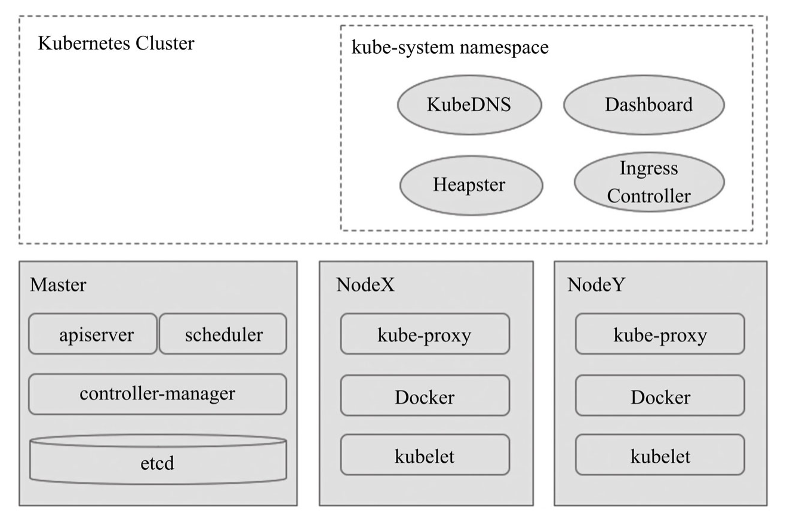

Kubernetes笔记 (1) - 系统概述

### Kubernetes概述
Kubernetes由google开源，它的开发和设计都深受Google内部久负盛名的系统Borg的影响，而且，它的许多顶级贡献者之前也是Borg系统的开发者。Borg是Google内部使用的大规模集群管理系统。

Kubernetes吸取了Borg在过去十数年间积累的经验和教训，刚刚面世就立即广受关注和青睐，目前已经成为容器编排领域事实上的标准。很多人将Kubernetes视为Borg系统的一个开源实现版本。

Kubernetes使用共享网络将多个物理机或虚拟机汇集到一个集群中，在各服务器之间进行通信，该集群是配置Kubernetes的所有组件、功能和工作负载的物理平台。集群包含Master和Node。
**Master**
Master是集群的网关和中枢，负责诸如为用户和客户端暴露API、跟踪其他服务器的健康状态、以最优方式调度工作负载，以及编排其他组件之间的通信等任务，它是用户或客户端与集群之间的核心联络点，并负责Kubernetes系统的大多数集中式管控逻辑。

**Node**
Node是Kubernetes集群的工作节点，负责接收来自Master的工作指令并根据指令相应地创建或销毁Pod对象，以及调整网络规则以合理地路由和转发流量等。

### Kubernetes集群组件
一个典型的Kubernetes集群由一个或一组Master和多个Node、一个集群状态存储系统（etcd）和add-ons组成。
**Kubernetes的系统架构：**

Master节点主要由apiserver、controller-manager和scheduler三个组件，以及一个用于集群状态存储的etcd存储服务组成，而每个Node节点则主要包含kubelet、kube-proxy及容器引擎等组件。

#### Master组件
##### API Server
API Server负责输出RESTful风格的KubernetesAPI，它是发往集群的所有REST操作命令的接入点，并负责接收、校验并响应所有的REST请求，结果状态被持久存储于etcd中。

##### Controller Manager
Kubernetes中，集群级别的大多数功能都是由几个被称为控制器的进程执行实现的，这几个进程被集成于kube-controller-manager守护进程中。由控制器完成的功能主要包括生命周期功能和API业务逻辑.
- 生命周期功能：包括Namespace创建和生命周期、Event垃圾回收、Pod终止相关的垃圾回收、级联垃圾回收及Node垃圾回收等。
- API业务逻辑：例如，由ReplicaSet执行的Pod扩展等

##### Scheduler
在API Server确认Pod对象的创建请求之后，Scheduler就会根据集群内各节点的可用资源状态，以及要运行的容器的资源需求做出调度决策。

##### Cluster State Store
etcd被用作Kubernetes集群状态的存储，etcd是独立的服务组件，并不隶属于Kubernetes集群自身。生产环境中应该以etcd集群的方式运行以确保其服务可用性。

#### Node组件
##### kubelet
kubelet是Node的核心代理程序，它是运行于工作节点之上的守护进程，从API Server接收关于Pod对象的配置信息并确保它们处于期望的状态（desired state）。kubelet会在API Server上注册当前工作节点，定期向Master汇报节点资源使用情况，并通过cAdvisor监控容器和节点的资源占用状况。

##### 容器运行时环境
每个Node都需要容器运行时（ContainerRuntime）环境，才能下载镜像、启动容器。kubelet以插件的方式载入配置的容器环境，目前支持Docker、RKT、cri-o和Fraki等容器环境。

##### kube-proxy
每个Node都需要运行一个kube-proxy守护进程，它能够按需为Service资源对象生成iptables或ipvs规则，从而捕获访问当前Service的ClusterIP的流量并将其转发至正确的后端Pod对象。

#### Addons
Kubernetes集群还依赖于一系列add-ons以提供完整的功能，它们通常是由第三方提供的特定应用程序，且托管运行于Kubernetes集群之上，比如
- KubeDNS：在Kubernetes集群中调度运行提供DNS服务的Pod，同一集群中的其他Pod可使用此DNS服务解析主机名。
- Kubernetes Dashboard：可以通过Dashboard来管理集群中的应用甚至是集群自身。
- Heapster：容器和节点的性能监控与分析系统，其功能会逐渐由Prometheus结合其他组件所取代。
- Ingress Controller：与负载均衡相关。

### Kubernetes网络模型基础
云计算的核心是虚拟化技术，网络虚拟化技术又是其最重要的组成部分，用于在物理网络上虚拟多个相互隔离的虚拟网络，实现网络资源切片，提高网络资源利用率，实现弹性化网络。

为了提供更灵活的解决方式，Kubernetes的网络模型需要借助于外部插件实现，它要求任何实现机制都必须满足以下需求：
- 所有Pod间均可不经NAT（网络地址转换）机制而直接通信
- 所有节点均可不经NAT机制而直接与所有容器通信
- 容器自己使用的IP也是其他容器或节点直接看到的地址，所有Pod对象都位于同一平面网络中，而且可以使用Pod自身的地址直接通信。

Kubernetes集群包含三种网络：
- 各主机（Master、Node和etcd等）自身所属的网络，用于各主机之间的通信，其地址配置于主机的网络接口，且在Kubernetes集群构建之前就已配置好，它并不能由Kubernetes管理。
- 专用于Pod资源对象的网络，它是一个虚拟网络，用于为各Pod对象设定IP地址等网络参数，其地址配置于Pod中容器的网络接口之上。Pod网络需要借助kubenet插件或CNI插件实现，插件可独立部署于Kubernetes集群之外，也可托管于Kubernetes之上，在创建Pod对象时由其自动完成各网络参数（Pod IP）的动态配置。
- 专用于Service资源对象的网络，也是虚拟网络，用于为Kubernetes集群之中的Service配置IP地址，但此地址并不配置于任何主机或容器的网络接口之上，而是通过Node之上的kube-proxy配置为iptables或ipvs规则，从而将发往此地址的所有流量调度至其后端的各Pod对象之上。Service网络在Kubernetes集群创建时予以指定，而各Service的地址（Cluster IP）则在用户创建Service时予以动态配置。

综上，Kubernetes为Pod和Service资源对象分别使用了各自的专用网络，Pod网络由Kubernetes的网络插件配置实现，而Service的网络则由Kubernetes集群予以指定。

##### 学习资料
《Kubernetes实战进阶》 马永亮著