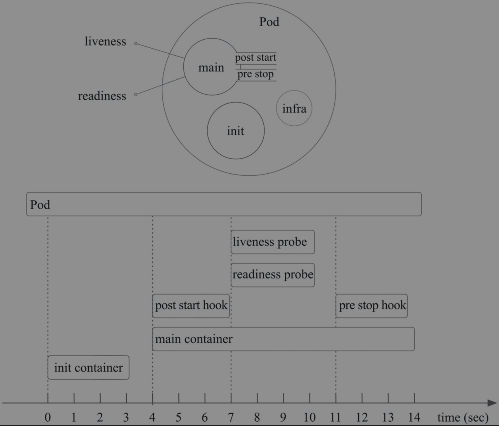
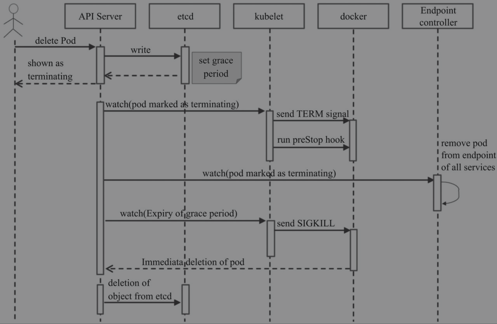

Kubernetes笔记(4) - Pod

- [容器与Pod的关系](#容器与pod的关系)
  - [Sidecar pattern（边车模式）](#sidecar-pattern边车模式)
- [管理Pod对象的容器](#管理pod对象的容器)
  - [定义镜像的获取策略](#定义镜像的获取策略)
  - [暴露端口](#暴露端口)
  - [自定义运行的容器化应用](#自定义运行的容器化应用)
  - [环境变量](#环境变量)
- [标签与标签选择器](#标签与标签选择器)
  - [标签的管理](#标签的管理)
  - [标签选择器](#标签选择器)
- [资源注解](#资源注解)
- [Pod对象的生命周期](#pod对象的生命周期)
  - [Phase](#phase)
  - [Pod的创建过程](#pod的创建过程)
  - [Pod生命周期中的重要行为](#pod生命周期中的重要行为)
    - [用于初始化的容器](#用于初始化的容器)
    - [生命周期钩子函数](#生命周期钩子函数)
    - [容器的重启策略](#容器的重启策略)
  - [Pod的终止过程](#pod的终止过程)
- [Pod存活性探测](#pod存活性探测)
  - [exec](#exec)
  - [httpGet](#httpget)
  - [tcpSocket](#tcpsocket)
  - [存活性探测行为属性](#存活性探测行为属性)
- [Pod就绪性探测](#pod就绪性探测)
- [资源需求及资源限制](#资源需求及资源限制)
  - [资源需求](#资源需求)
  - [资源限制](#资源限制)
  - [Pod的服务质量类别](#pod的服务质量类别)


Pod是Kubernetes系统的基础单元，是资源对象模型中可由用户创建或部署的最小组件，也是在Kubernetes系统上运行容器化应用的资源对象。

### 容器与Pod的关系
Docker推荐采用单容器单进程的方式运行，但由于容器间的隔离机制，各容器进程间又无法实现IPC（Inter-Process Communication）通信。这就导致功能相关的容器之间通信困难，比如主容器与负责日志收集的容器之间的通信。而Pod资源抽象正是用来解决此类问题的组件，Pod对象是一组容器的集合，这些容器共享Network、UTS（UNIX Time-sharing System）及IPC名称空间，因此具有相同的域名、主机名和网络接口，并可通过IPC直接通信。
为一个Pod对象中的各容器提供网络名称空间等共享机制的是底层基础容器pause。
尽管Pod支持运行多个容器，但作为最佳实践，除非多个进程之间具有密切的关系，否则都应该将其构建到多个Pod中，这样多个Pod可被调度至多个不同的主机运行，提高了资源利用率，也便于规模的伸缩。

#### Sidecar pattern（边车模式）
多个进程之间具有密切的关系时，一般按照边车模型来组织多个容器，边车即为Pod的主应用容器提供协同的辅助应用容器，典型的应用场景是将主应用容器中的日志使用agent收集至日志服务器中时，可以将agent运行为辅助应用容器。

### 管理Pod对象的容器
Pod的配置清单举例：
 ```
apiVersion: v1
kind: Pod
metadata:
  name: pod-example
spec:
  containers:
  - name: myapp
    image: ikubernetes/myapp:v2
 ```
其中spec字段下，containers为及其子字段name为必选项，image在手动场景Pod时必选，在但在被高级别管理资源如Deployment控制时可选，因为这个字段可能会被覆盖。

#### 定义镜像的获取策略
Pod的核心功能是运行容器，而 通过image.imagePullPolicy可以自定义镜像的获取策略。
- Always：镜像标签为“latest”或镜像不存在时总是从指定的仓库中获取镜像
- IfNotPresent：仅当本地镜像缺失时才从目标仓库下载镜像
- Never：禁止从仓库下载镜像，即仅使用本地镜像

 ```
spec:
  containers:
  - name: myapp
    image: ikubernetes/myapp:v2
      imagePullPolicy: Always  
 ```

对于标签为“latest”的镜像文件，其默认的镜像获取策略即为“Always”，而对于其他标签的镜像，其默认策略则为“IfNotPresent”。

#### 暴露端口
在Pod中暴露端口与为Docker容器暴露端口的意义不一样：
在Docker的网络模型中，使用默认网络的容器化应用需通过NAT机制将其“暴露”（expose）到外部网络中才能被其他节点之上的容器客户端所访问；
而在K8S中，各Pod的IP地址已经处于同一网络平面，无论是否为容器暴露端口，都不会影响集群中其他节点之上的Pod客户端对其进行访问，所以暴露的端口只是信息性数据，而且显式指定容器端口也方便调用。
 ```
spec:
  containers:
  - name: myapp
    image: ikubernetes/myapp:v2
    ports:
    - name: http
      containerPort: 80
      protocol: TCP
 ```
这里的配置指定暴露容器上的TCP端口80，并将其命名为http。
Pod对象的IP地址仅在当前集群内可达，它们无法直接接收来自集群外部客户端的请求流量，尽管它们的服务可达性不受工作节点边界的约束，但依然受制于集群边界。如何让集群外部访问到Pod对象，将在后面学习。

#### 自定义运行的容器化应用
command字段能够指定不同于镜像默认运行的应用程序，并且可以同时使用args字段进行参数传递，它们将覆盖镜像中的默认定义。不过，如果仅为容器定义了args字段，那么它将作为参数传递给镜像中默认指定运行的应用程序；如果仅为容器定义了command字段，那么它将覆盖镜像中定义的程序及参数，并以无参数方式运行应用程序。
 ```
spec:
  containers:
  - name: myapp
    image: ikubernetes/myapp:v2 
    imagePullPolicy: Never     
    command: ["/bin/sh"]
    args: ["-c", "while true; do sleep 30; done"]
 ```

#### 环境变量
环境变量也是向容器化应用传递配置的一种方式，向Pod对象中的容器环境变量传递数据的方法有两种：env和envFrom，这里只介绍第一种方式，第二种方式将在介绍ConfigMap和Secret资源时进行说明。环境变量通常由name和value字段构成。
 ```
spec:
  containers:
  - name: myapp
    image: ikubernetes/myapp:v2 
    env:
    - name: REDIS_HOST
      value: do.macOS
    - name: LOG_LEVEL
      value: info
 ```

### 标签与标签选择器
#### 标签的管理
标签选择器可以对附带标签的资源对象进行挑选，并进行所需要的操作。一个对象可拥有不止一个标签，而同一个标签也可被添加至多个资源之上。
可以为资源附加多个不同纬度的标签以实现灵活的资源分组管理功能，例如，版本标签、环境标签、分层架构标签等，用于交叉标识同一个资源所属的不同版本、环境及架构层级等。
定义标签示例：
 ```
apiVersion: v1
kind: Pod
metadata:
  name: pod-example
  labels:
    env: qa
    tier: frontend
 ```
资源创建后，在`kubectl get pods`命令中添加`--show-labels`选项就可显示lables信息。
`-L <key1>, <key2>`选项可增加对应的列信息。
直接管理活动对象的标签:
 ```js
kubectl label pods/pod-example release=beta
  ```
为pod-example添加了release=beta，如果要修改已经存在的键值对对，需要添加`--overwrite`选项。

#### 标签选择器
标签选择器用于表达标签的查询条件或选择标准，Kubernetes API目前支持两个选择器：
- equality-based，可用操作符有“=”“==”和“! =”三种，前两种等价
- set-based，支持in、notin和exists三种操作符，此外还有可以只指定KEY来筛选所有存在此键名标签的资源，!KEY则筛选所有不存在此键名标签的资源
使用标签选择器时遵循以下逻辑:
- 同时指定的多个选择器之间的逻辑关系为“与”操作
- 使用空值的标签选择器意味着每个资源对象都将被选中
- 空的标签选择器将无法选出任何资源。

Kubernetes的诸多资源对象必须以标签选择器的方式关联到Pod资源对象，例如Service、Deployment和ReplicaSet类型的资源等，可以在spec字段通过嵌套的“selector”字段来指定选择器，有两种方式：
- matchLabels：通过直接给定键值对来指定标签选择器
- matchExpressions：基于表达式指定的标签选择器列表，每个选择器都形如“{key:KEY_NAME, operator: OPERATOR,values: [VALUE1, VALUE2, …]}”，选择器列表间为“逻辑与”关系；使用In或NotIn操作符时，其values不强制要求为非空的字符串列表，而使用Exists或DostNotExist时，其values必须为空。
格式举例：
 ```
selector:
  matchLabels:
    component: redis
  matchExpressions:
    - {key: tier, operator: In, values: [cache]}
    - {key: environment, operator: Exists, values:}
 ```

### 资源注解
标签之外，Pod与其他各种资源还能使用资源注解（annotation），也是键值类型的数据，不过它不能用于标签及挑选Kubernetes对象，仅可用于为资源提供“元数据”信息。另外，注解中的元数据不受字符数量的限制，可以为结构化或非结构化形式，而且对字符类型也没有限制。
Annotation中放置构建、发行或镜像相关的信息，指向日志、监控、分析或审计仓库的地址，或者由客户端库或工具程序生成的用于调试目的的信息：如名称、版本、构建信息等信息。

**查看资源注解**
使用`kubectl get -o yaml`和`kubectl describe`命令均能显示资源的注解信息。
 ```
kubectl describe pods pod-example | grep "Annotations"
 ```
**管理资源注解**
在配置清单中定义annotations：
 ```
apiVersion: v1
kind: Pod
metadata:
  name: pod-example
  annotations:
    created-by: "cluster admin"
 ```
追加annotations：
 ```
kubectl annotate pods pod-example created-by2="admin"
 ```

### Pod对象的生命周期
Pod的生命周期如图：

#### Phase
Pod对象总是应该处于其生命进程中以下几个Phase（阶段）之一：
- Pending:API Server创建了Pod资源对象并已存入etcd中，但它尚未被调度完成，或者仍处于从仓库下载镜像的过程中。‰
- Running:Pod已经被调度至某节点，并且所有容器都已经被kubelet创建完成。‰
- Succeeded:Pod中的所有容器都已经成功终止并且不会被重启。‰
- Failed：所有容器都已经终止，但至少有一个容器终止失败，即容器返回了非0值的退出状态或已经被系统终止。‰
- Unknown:API Server无法正常获取到Pod对象的状态信息，通常是由于其无法与所在工作节点的kubelet通信所致。

#### Pod的创建过程
Pod的创建过程是指Pod自身及其主容器及其辅助容器创建的过程。


1. 用户通过kubectl或其他API客户端提交PodSpec给API Server。
1. API Server尝试着将Pod对象的相关信息存入etcd中，待写入操作执行完成，API Server即会返回确认信息至客户端。
1. API Server开始反映etcd中的状态变化。
1. 所有的Kubernetes组件均使用“watch”机制来跟踪检查API Server上的相关的变动。
1. kube-scheduler（调度器）通过其“watcher”觉察到API Server创建了新的Pod对象但尚未绑定至任何工作节点。
1. kube-scheduler为Pod对象挑选一个工作节点并将结果信息更新至API Server。
1. 调度结果信息由API Server更新至etcd存储系统，而且API Server也开始反映此Pod对象的调度结果。
1. Pod被调度到的目标工作节点上的kubelet尝试在当前节点上调用Docker启动容器，并将容器的结果状态回送至API Server。
1. API Server将Pod状态信息存入etcd系统中。
1. 在etcd确认写入操作成功完成后，API Server将确认信息发送至相关的kubelet，事件将通过它被接受。

#### Pod生命周期中的重要行为
除了创建应用容器（主容器及其辅助容器）之外，用户还可以为Pod对象定义其生命周期中的多种行为，如用于初始化的容器、存活性探测及就绪性探测等

##### 用于初始化的容器
用于初始化的容器(init container)是应用程序的主容器启动之前要运行的容器，常用于为主容器执行一些预置操作，典型的应用如：
- 用于运行特定的工具程序，出于安全等方面的原因，这些程序不适于包含在主容器镜像中。
- 提供主容器镜像中不具备的工具程序或自定义代码。
- 为容器镜像的构建和部署人员提供了分离、独立工作的途径，使得他们不必协同起来制作单个镜像文件。
- 初始化容器和主容器处于不同的文件系统视图中，因此可以分别安全地使用敏感数据，例如Secrets资源。
- 初始化容器要先于应用容器串行启动并运行完成，因此可用于延后应用容器的启动直至其依赖的条件得到满足。

在资源清单中通过initContainers字段定义：
 ```
spec:
  containers:
  - name: myapp
    image: ikubernetes/myapp:v2 
  initContainers:
  - name: init-something
    image: busybox
    command: ['sh', '-c', 'sleep 10'] 
 ```
##### 生命周期钩子函数
Kubernetes为容器提供了两种生命周期钩子：
- postStart：在容器创建完成之后立即运行，但是Kubernetes无法确保它一定会在容器中的ENTRYPOINT之前运行。
- preStop：在容器终止操作之前立即运行，它以同步的方式调用，因此在其完成之前会阻塞删除容器的操作。

钩子函数的实现方式有“Exec”和“HTTP”两种，前一种在钩子事件触发时直接在当前容器中运行由用户定义的命令，后一种则是在当前容器中向某URL发起HTTP请求。钩子函数定义在容器的spec.lifecycle字段。

##### 容器的重启策略
容器程序发生崩溃或容器申请超出限制的资源等原因都可能会导致Pod对象的终止，此时是否应该重建该Pod对象则取决于其重启策略（restartPolicy）属性的定义。
- Always：只要Pod对象终止就将其重启，此为默认设定。
- OnFailure：仅在Pod对象出现错误时方才将其重启。
- Never：从不重启。

容器在重启失败后，之后的重启将有一段时间的延迟，且延迟时间越来越长，依次为10秒、20秒、40秒、80秒、160秒、300秒。

#### Pod的终止过程

1. 用户发送删除Pod对象的命令。
1. API服务器中的Pod对象会随着时间的推移而更新，在宽限期内（默认为30秒），Pod被视为“dead”。
1. 将Pod标记为“Terminating”状态。
1. （与第3步同时运行）kubelet在监控到Pod对象转为“Terminating”状态的同时启动Pod关闭过程。
1. （与第3步同时运行）端点控制器监控到Pod对象的关闭行为时将其从所有匹配到此端点的Service资源的端点列表中移除。
1. 如果当前Pod对象定义了preStop钩子处理器，则在其标记为“terminating”后即会以同步的方式启动执行；如若宽限期结束后，preStop仍未执行结束，则第2步会被重新执行并额外获取一个时长为2秒的小宽限期。
1. Pod对象中的容器进程收到TERM信号。
1. 宽限期结束后，若存在任何一个仍在运行的进程，那么Pod对象即会收到SIGKILL信号。
1. Kubelet请求API Server将此Pod资源的宽限期设置为0从而完成删除操作，它变得对用户不再可见。

如果在等待进程终止的过程中，kubelet或容器管理器发生了重启，那么终止操作会重新获得一个满额的删除宽限期并重新执行删除操作。

### Pod存活性探测
kubelet可基于存活性探测判定何时需要重启一个容器。可通过spec.containers.livenessProbe定义，支持三种探测方法：
- exec
- httpGet
- tcpSocket

#### exec
exec类型的探针通过在目标容器中执行由用户自定义的命令来判定容器的健康状态，若命令状态返回值为0则表示“成功”通过检测，其它值均为“失败”状态。它只有一个可用属性“command”，用于指定要执行的命令，示例：
 ```
apiVersion: v1
kind: Pod
metadata:
  name: liveness-exec-demo
  labels:
    test: liveness-exec-demo
spec:
  containers:
  - name: liveness-exec-demo
    image: busybox 
    args: ["/bin/sh", "-c", " touch /tmp/healthy;sleep 60; rm -rf /tmp/healthy;sleep 600"]
    livenessProbe:
      exec:
        command: ["test", "-e", "/tmp/healthy"]
 ```
这段配置清单基于busybox镜像启动一个容器，并执行args定义的命令，此命令在容器启动时创建/tmp/healthy文件，并于60秒之后将其删除。存活性探针运行“test -e/tmp/healthy”命令检查/tmp/healthy文件的存在性，若文件存在则返回状态码0，表示成功通过测试。
所以60秒后使用describe命令可以看到容器被重启的event。

#### httpGet
httpGet方式是向目标容器发起一个HTTP GET请求，根据其响应码进行结果判定，2xx或3xx时表示检测通过。
可配置字段有：
- host，请求的主机地址，默认为Pod IP，也可以在httpHeaders中使用“Host:”来定义。
- port，请求的端口，必选字段。
- httpHeaders，自定义的请求报文头。
- path，请求的HTTP资源路径。
- scheme：建立连接使用的协议，仅可为HTTP或HTTPS，默认为HTTP。

示例
 ```
apiVersion: v1
kind: Pod
metadata:
  name: liveness-http-demo
  labels:
    test: liveness-http-demo
spec:
  containers:
  - name: liveness-http-demo
    image: nginx:1.12-alpine
    ports:
    - name: http
      containerPort: 80
    lifecycle:
      postStart:
        exec:
          command: ["/bin/sh", "-c", " echo Healthy > /usr/share/nginx/html/healthz"]
    livenessProbe:
      httpGet:
        path: /healthz
        port: http
        scheme: HTTP
 ```

这个配置清单通过postStart hook创建了一个专用于httpGet测试的页面文件healthz。而为httpGet探测指定的路径为“/healthz”，地址默认为Pod IP，端口使用了容器中定义的端口名称http。
启动容器后健康检查是正常的，但执行如下命令删除healthz页面后，可在event中看到`Container liveness-http-demo failed liveness probe, will be restarted`。
 ```
kubectl exec liveness-http-demo rm /usr/share/nginx/html/healthz
 ```
一般应为HTTP探测操作定义专用的URL路径，此URL路径对应的Web资源应该以轻量化的方式在内部对应用程序的各关键组件进行全面检测以确保它们可正常向客户端提供完整的服务。

#### tcpSocket
基于TCP的存活性探测用于向容器的特定端口发起TCP请求并尝试建立连接，连接建立成功即为通过检测。相比较来说，它比基于HTTP的探测要更高效、更节约资源，但精准度较低。
可配置字段有：
- host，请求连接的目标IP地址，默认为Pod IP。
- port，请求连接的目标端口，必选字段。

举例：
 ```
spec:
  containers:
  - name: liveness-tcp-demo
    image: nginx:1.12-alpine 
    livenessProbe:
      tcpSocket:
        port: 80
 ```

#### 存活性探测行为属性
对于配置了liveness的pod，通过describe命令可以看到类似这样的信息，有delay、timeout等配置，由于之前没有指定所以都为默认值：
 ```
Liveness:       tcp-socket :80 delay=0s timeout=1s period=10s #success=1 #failure=3
 ```

- initialDelaySeconds，存活性探测延迟时长，即容器启动多久之后再开始第一次探测操作，显示为delay属性，默认为0秒，整型
- timeoutSeconds，存活性探测的超时时长，显示为timeout属性，默认为1s，整型，最小1s
- periodSeconds，存活性探测的频度，显示为period属性，整型，默认为10s，最小值为1s；过高的频率会对Pod对象带来较大的额外开销，而过低的频率又会使得对错误的反应不及时
- successThreshold，处于失败状态时，探测操作至少连续多少次的成功才被认为是通过检测，显示为#success属性，默认值为1，最小值也为1，整型
- failureThreshold：处于成功状态时，探测操作至少连续多少次的失败才被视为是检测不通过，显示为#failure属性，默认值为3，最小值为1，整型。

另外，liveness检测仅对当前服务有效，比如当后端服务（如数据库或缓存服务）导致故障时，重启当前服务并不能解决问题，但它却会被一次次重启，直到后端服务恢复正常为止。

### Pod就绪性探测
Pod对象启动后，容器应用通常需要一段时间才能完成其初始化过程，例如加载配置或数据，甚至有些程序还需要预热的过程。因此应该避免在Pod对象启动后立即让其处理客户端请求，而是等待容器初始化工作执行完成并转为Ready状态，尤其是存在其他提供相同服务的Pod对象的场景更是如此。
就绪性探测是用来判断容器就绪与否的周期性操作，探测操作返回“success”状态时，就认为容器已经就绪。
与liveness探测类似，它也支持三种方式，但定义时使用的属性名为readinessProbe。
举例：
 ```
apiVersion: v1
kind: Pod
metadata:
  name: readiness-tcp-demo
  labels:
    test: readiness-tcp-demo
spec:
  containers:
  - name: readiness-tcp-demo
    image: nginx:1.12-alpine 
    readinessProbe:
      tcpSocket:
        port: 80
 ```
未定义就绪性探测的Pod对象在Pod进入“Running”状态后将立即就绪。生产实践中，必须为需要时间进行初始化容器以及关键性Pod资源中的容器定义就绪性探测。

### 资源需求及资源限制
K8S中可由容器或Pod请求或消费的“计算资源”是指CPU和内存，其中CPU属于可压缩（compressible）型资源，可按需收缩，而内存则是不可压缩型资源，对其执行收缩操作可能会导致无法预知的问题。
目前资源隔离属于容器级别，所以CPU和内存资源的配置需要在Pod中的容器上进行，支持两种属性：
- requests，定义了其请求的确保可用值，即容器运行可能用不到这些额度的资源，但用到时必须要确保有如此多的资源可用；
- limits，限制资源可用的最大值

在K8S中，1个单位的CPU相当于虚拟机上的1颗虚拟CPU（vCPU）或物理机上的一个超线程（Hyperthread，或称为一个逻辑CPU），它支持分数计量方式，一个核心（1 core）相当于1000个微核心（millicores），因此500m相当于是0.5个核心。内存的计量方式与日常使用方式相同，默认单位是字节，也可以使用E(Ei)、P(Pi)、T(Ti)、G(Gi)、M(Mi)和K(Ki)作为单位后缀。

#### 资源需求
 ```
apiVersion: v1
kind: Pod
metadata:
  name: stress-demo
spec:
  containers:
  - name: stress-demo
    image: ikubernetes/stress-ng
    command: ["/usr/bin/stress-ng", "-m 1", "-c 1", "--metrics-brief"]
    resources:
      requests:
        memory: "128Mi"
        cpu: "200m"
 ```
以上的配置清单定义了容器的资源需求为128M内存、200m(0.2)个CPU核心。它运行stress-ng(一个多功能系统压力测工具)镜像启动一个进程（-m 1）进行内存性能压力测试，再启动一个专用的CPU压力测试进程（-c 1）。
然后使用`kubectl exec stress-demo -- top`命令来查看资源的使用情况，在我的电脑（6核，内存16G）上显示的内存占用为262m，CPU占用2*17%（约等于2/6，因为两个测试线程分布于两个CPU核心以满载的方式运行），都远高于requests中定义的值，这是因为当前资源充裕，一旦
资源紧张时，节点仅保证容器有五分之一个CPU核心可用，对于有着6个核心的节点来说，它的占用率约为3.33%，多占用的资源会被压缩。内存为非可压缩型资源，所以此Pod在内存资源紧张时可能会因OOM被杀死（killed）。
如果没有定义requests，那么在CPU资源紧张时，可能会被其它Pod压缩至极低的水平，甚至会达到Pod不能够被调度运行的境地，而不可压缩型的内存资源，则可能因OOM导致进程被杀死。因此在Kubernetes系统上运行关键型业务相关的Pod时必须使用requests属性为容器定义资源的确保可用量。

集群中的每个节点拥有的CPU和内存资源是固定的，Kubernetes的调度器在调度Pod时，会根据容器的requests属性来判定哪些节点可接收运行当前的Pod资源，而对于一个节点的资源来说，每运行一个Pod对象，其requests中定义的请求量都要被预留，直到给所有Pod对象分配完为止。

#### 资源限制
通过定义资源需求可以保证容器的最少资源量，如果要限制容器使用资源的上限，则需要定义资源限制。
如果定义了资源限制，则容器进程无法获得超出其CPU配额的可用时间，而进程申请分配超出其limits定义的内存资源时，它将被OOM killer杀死。

#### Pod的服务质量类别
Kubernetes允许节点资源对limits的过载使用，这意味着节点无法同时满足其上的所有Pod对象以资源满载的方式运行。于是就需要确定Pod对象的优先级，在内存资源紧缺时，先终止低优先级的Pod对象。
Pod对象的优先级是根据requests和limits属性确定的，分为三个级别或QoS(Quality of Service）:
- Guaranteed，Pod中所有容器对所有资源类型都定义了Limits和Requests，而且Limits值等于Requests值且不为0，Requests值未定义时默认等于Limits，优先级最高。
- BestEffort，没有为任何一个容器设置requests或limits属性的Pod资源属于这一类，优先级最低。
- Burstable，不为Guaranteed和BestEffort时，优先级中等。

以上只适用于内存资源紧缺时，CPU资源无法得到满足时，Pod仅仅是暂时获取不到相应的资源而已。

##### 学习资料
《Kubernetes实战进阶》 马永亮著