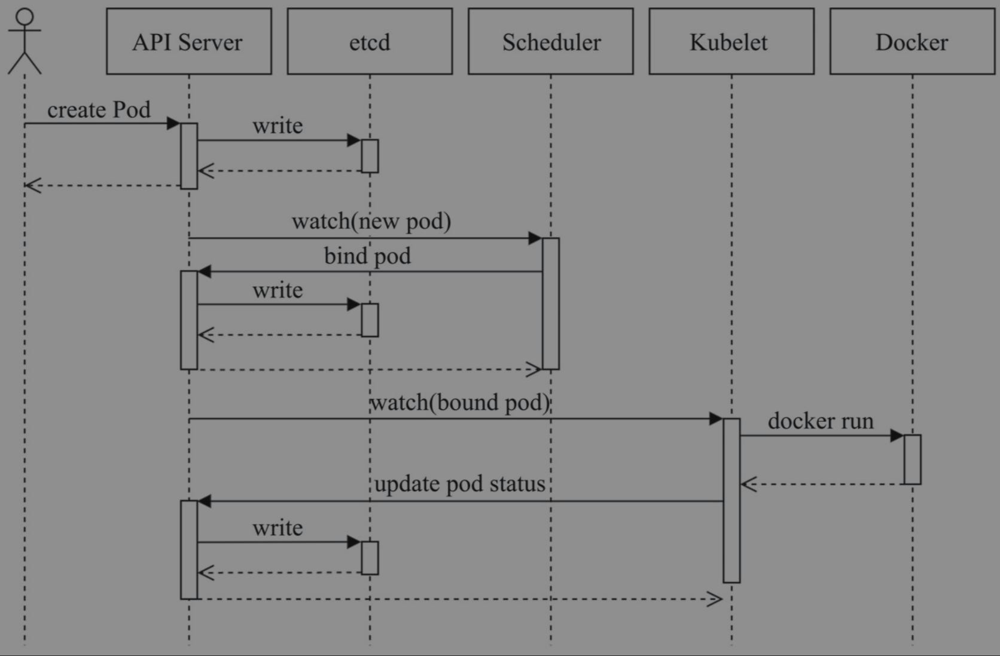

kubectl get namespaces

kubectl get pods -n kube-system

kubectl explain pods

### 启动代理并调用:
kubectl proxy --port=8080
curl localhost:8080/api/v1/namespaces/kube-system
kubectl get namespaces kube-system -o json

### 资源对象管理: 陈述式、声明式
陈述式：
  kubectl run nginx-deploy --image=nginx:1.12
声明式：
  kubectl apply -f 3_pod-example.yaml
陈述式对象配置：
  kubectl create -f 3_pod-example.yaml

### Pod
#### Pod的配置清单举例：
 ```
apiVersion: v1
kind: Pod
metadata:
  name: pod-example
spec:
  containers:
  - name: myapp
    image: ikubernetes/myapp:v1
 ```

#### 标签与标签选择器
kubectl get pods --show-labels
kubectl get pods -L env,tier

**新增、修改标签**
  apply
  kubectl label pods/pod-example release=beta
  kubectl label pods/pod-example env=qa --overwrite

**标签选择器**
kubectl get pods --show-labels -l env=qa
kubectl get pods --show-labels -l 'tier in (frontend), env=qa'
kubectl get pods --show-labels -l '!env1'

 ```
selector:
  matchLabels:
    component: redis
  matchExpressions:
    - {key: tier, operator: In, values: [cache]}
    - {key: environment, operator: Exists, values:}
 ```

#### Pod的创建过程
Pod的创建过程是指Pod自身及其主容器及其辅助容器创建的过程。


1. 用户通过kubectl或其他API客户端提交PodSpec给API Server。
1. API Server尝试着将Pod对象的相关信息存入etcd中，待写入操作执行完成，API Server即会返回确认信息至客户端。
1. API Server开始反映etcd中的状态变化。
1. 所有的Kubernetes组件均使用“watch”机制来跟踪检查API Server上的相关的变动。
1. kube-scheduler（调度器）通过其“watcher”觉察到API Server创建了新的Pod对象但尚未绑定至任何工作节点。
1. kube-scheduler为Pod对象挑选一个工作节点并将结果信息更新至API Server。
1. 调度结果信息由API Server更新至etcd存储系统，而且API Server也开始反映此Pod对象的调度结果。
1. Pod被调度到的目标工作节点上的kubelet尝试在当前节点上调用Docker启动容器，并将容器的结果状态回送至API Server。
1. API Server将Pod状态信息存入etcd系统中。
1. 在etcd确认写入操作成功完成后，API Server将确认信息发送至相关的kubelet，事件将通过它被接受。

#### 就绪性探测
kubectl exec liveness-http-demo -- rm /usr/share/nginx/html/healthz

- initialDelaySeconds(0)
- timeoutSeconds(1)
- periodSeconds(10)
- successThreshold(1)
- failureThreshold(3)

#### 资源需求及资源限制
kubectl exec stress-demo -- top

### Pod Controller
#### ReplicaSet
kubectl get pods -l app=rs-demo
kubectl get replicaset rs-example -o wide
kubectl label pods/pod-example1 app=rs-demo  --overwrite
kubectl scale replicasets rs-example --replicas=4
kubectl scale replicasets rs-example --current-replicas=4 --replicas=2
kubectl delete -f 5_replicaSet_demo.yaml --cascade=false

#### Deployment
kubectl get deployments myapp-deploy
kubectl get replicasets -l app=myapp
kubectl get pods -l app=myapp
kubectl describe deployments myapp-deploy

kubectl rollout status deployments myapp-deploy --watch
kubectl set image deployments myapp-deploy myapp=ikubernetes/myapp:v2 --record=true
kubectl rollout history deployments myapp-deploy
kubectl rollout undo deployments myapp-deploy --to-revision=2
maxSurge和maxUnavailable相当于定义了pod数量的波动范围

##### Canary
kubectl set image deployments myapp-deploy myapp=ikubernetes/myapp:v2 --record=true && kubectl rollout pause deployments myapp-deploy
kubectl rollout status deployments myapp-deploy 
kubectl rollout resume deployments myapp-deploy

#### Job

#### Cronjob
schedule的语法 https://kubernetes.io/zh/docs/concepts/workloads/controllers/cron-jobs/#cron-%E6%97%B6%E9%97%B4%E8%A1%A8%E8%AF%AD%E6%B3%95)，
kubectl logs cronjob-example-1620625380-sg7zq